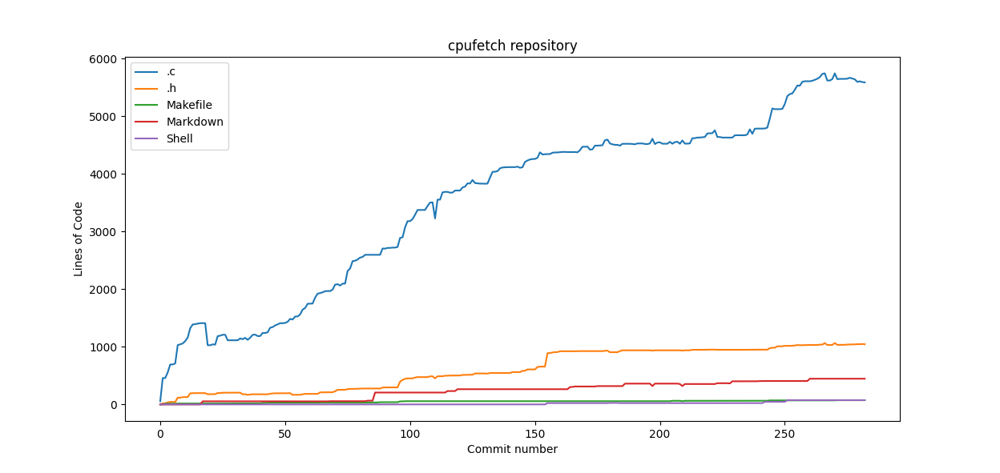

# gitplot

Simple python script that plots the evolution of lines of code of a git repository over time.

It currently supports ploting the following extensions/source files:

- C code (.c)
- C headers (.h)
- Markdown (.md)
- Makefile

##### Dependencies
- numpy
- matplotlib

To install them:

```
[drnoob@laptop gitplot]$ pip install --user matplotlib
[drnoob@laptop gitplot]$ pip install --user numpy
```

##### Usage

```
[drnoob@laptop gitplot]$ ./gitplot.py "$URL"
# For example:
[drnoob@laptop gitplot]$ ./gitplot.py "https://github.com/Dr-Noob/cpufetch"
```

##### Example

